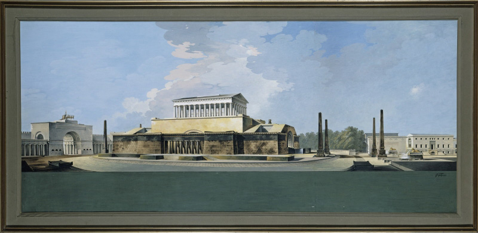
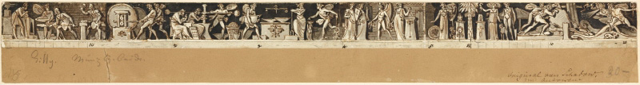
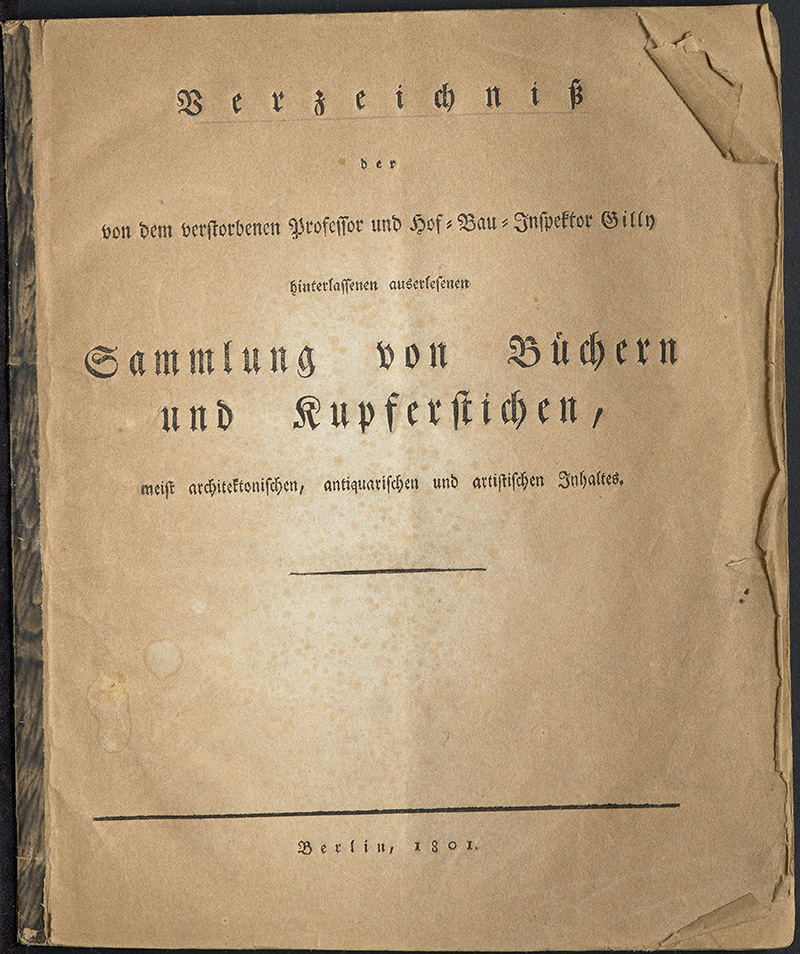

By Barry Bergdoll

*Review of: Die Büchersammlung Friedrich Gillys (1772–1800): Provenienz und Schicksal einer Architektenbibliothek im theoretischen Kontext des 18. Jahrhunderts. By Michael Bollé and Maria Ocón Fernández. Originally published in: The Burlington Magazine 162, December 2020. Republished here with the author's permission.*

Just three years after the Prussian king Friedrich William III signed a decree in March 1799 organising the Berlin Bauakademie, the earliest state-sponsored school of architecture in the German-speaking lands, the new school’s teaching collections grew exponentially with the purchase of the architectural library assembled by a recently deceased young faculty member, Friedrich Gilly (1772–1800). As he came of age in the 1790s, Gilly had been hailed as a precocious genius both by architects and by the Romantic poets he frequented, notably Wilhelm Heinrich Wackenroder and Ludwig Tieck. His stirring architectural designs, most of which remained on paper, attracted more attention than his handful of largely private commissions in the countryside. His unbuilt proposal for a pure Grecian Doric temple in memory of Frederick the Great, raised on a stepped platform in the centre of Leipziger Platz, Berlin, included a newly redesigned city gate in the form of a radically abstracted propylaeum that stole the show at the 1796 Academy exhibition.

Image: *Entwurf zu einem Denkmal für Friedrich den Großen auf dem Leipziger Platz in Berlin by Friedrich Gilly (1796)*. Collection: <a href="https://smb.museum-digital.de/index.php?t=objekt&oges=96886">Kupferstichkabinett, Staatliche Museen zu Berlin</a>.

It was taken as gospel throughout the nineteenth century that this image alone inspired the teenage Karl Friedrich Schinkel to drop his plans to study music and to enroll in the private architectural school organised by Gilly’s father, David, the forerunner of the Bauakademie.

With Friedrich Gilly’s death from consumption aged only twenty-eight, his memory was to become an almost legendary part of the growing ethos that Berlin hosted a school not only as a pedagogical undertaking but a ‘Berlin School’ of brilliant designers, dedicated to a unified reinvigoration of classical culture to meet both the practical and representational demands of Prussia. The young architect’s library of several hundred volumes was catalogued for sale in 1801 and acquired in toto in 1802 by the Bauakademie, now housed in the upper floor of the newly completed Royal Mint designed by Gilly’s brother-in-law Heinrich Gentz, a building whose distinctive formal expression was to occasion lively debates over the question of style in public buildings. The Bauakademie took over from the Academy of Arts the role as the locus of the project to create a unified Prussian architecture, its curriculum reinforced by a rapidly amassed collection of architectural models, engravings and, most importantly, books.

Image: *Relieffries an der Alten Münze zu Berlin by Friedrich Gilly (before 1800)*. Collection: <a href="https://smb.museum-digital.de/index.php?t=objekt&oges=95266">Kupferstichkabinett, Staatliche Museen zu Berlin</a>.

Although Gilly’s erudition was referred to by his first biographers, the precise contents of his library remained unknown until some twenty-five years ago. The discovery in the Prussian State archives of the apparently sole surviving copy of a printed inventory of 1801, thought to have been drawn up by David Gilly, opened up new possibilities for understanding the sources of Berlin *Klassizimus* in what has long been seen as one of its most inventive moments. A facsimile was published in 1994 as an appendix to Fritz Neumeyer’s anthology of the small corpus of Gilly’s writings as evidence of his deep knowledge of classics, antiquities and modern architectural theory.[^1] Gilly’s actual books were thought to have been lost in bombings in the Second World War, which destroyed the library of the Technische Hochschule, a successor institution to the Bauakademie. The volume under review is born of the discovery just a few years ago that a significant number of his books survive in the collection of what is today the Universität der Künste Berlin, the descendant of the eighteenth-century Prussian art academy.

Image: *Verzeichniß der von dem verstorbenen Professor und Hof-Bau-Inspektor Gilly hinterlassenen auserlesenen Sammlung von Büchern und Kupferstichen, meist architektonischen, antiquarischen und artistischen Inhaltes (Berlin, 1801)*. Collection: <a href="https://haab-digital.klassik-stiftung.de/viewer/resolver?urn=urn:nbn:de:gbv:32-1-10030771341">Goethes Privatbibliothek in der Klassik Stiftung Weimar</a>.

A valuable essay on the complex institutional landscape of art and architecture education in late eighteenthcentury Berlin, as well as of the bibliographic vicissitudes of Berlin art and architecture libraries, opens this impeccable scholarly tool, which has been edited by two of Berlin’s leading scholars of modern architectural institutions. Concise and informative entries on each of the books, as well as an easy-to-use graphic coding highlighting the entries that correspond to the surviving copies from Gilly’s collection, make this book as valuable for historians of architectural literature in general as it is for further study of the interdisciplinary matrix that nourished the select private society of young architects that Gilly gathered around him in a club based on a romantic notion of Plato’s academy.[^2] This ‘private society’ included not only Schinkel, who would shape royal Berlin after the Napoleonic Wars, but also his counterpart in Ludwig I’s Munich, Leo von Klenze.

Michael Bollé, who has almost singlehandedly deepened understanding of Berlin’s vibrant architectural culture in the final years of the eighteenth century, contributes an essay at the end of the volume that provides an overview of Gilly’s library, pointing out not only its great strengths in travel literature, Classical history and inclusion of most of the important architectural and aesthetic treatises of the eighteenth century, but also some very surprising gaps, most notably some of the most influential texts of the mid-eighteenth century, such as the Abbé Laugier’s controversial *Essai sur l’architecture* (1753). But, as Bollé is quick to point out, conclusions drawn from the inventory need to be qualified by noting the limitations in our knowledge of the books in Berlin’s private and state collections at the time, including the large libraries of David Gilly and of Heinrich Gentz, whose importance in Berlin architectural culture continues unjustly in the shadow of the romanticised reputation of the younger Gilly. Further complicating matters is evidence that the Gillys, father and son, acquired books in Paris, for instance, not only for themselves but for the library of the Bauakademie, emphasising how entwined this family of architects was with the institutions that they helped craft. Largely a work of bibliographical research, this beautifully produced volume reveals in the end more about the institutional frame of Berlin’s first internationally admired period in architecture than about the designs that were produced then, leaving the impact of Gilly the bibliophile on Gilly the designer of buildings, furniture and city plans for further scholarly interpretation.

[^1]: F. Neumeyer, ed.: *Friedrich Gilly: Essays on Architecture, 1796–1799*, transl. David Britt, Los Angeles 1994, pp.183–218.

[^2]: On this subject, see R. Bothe, ed.: exh. cat. *Friedrich Gilly, 1772–1800, und die Privatgesellschaft junger Architekten*, Berlin (Staatliche Museen) 1984.